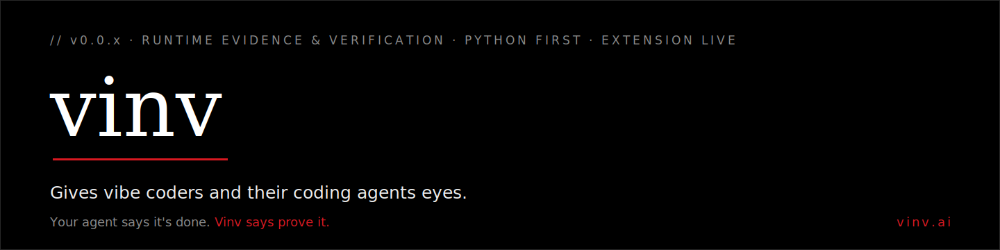
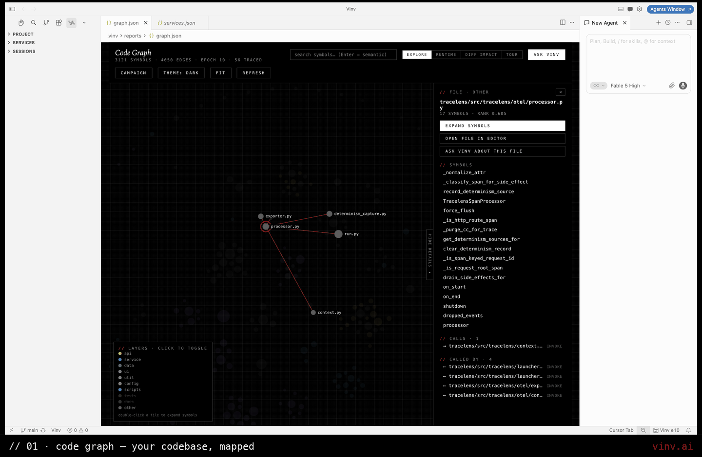

<div align="center">

<picture>
  <source media="(prefers-color-scheme: dark)" srcset="./.github/assets/vinv-banner-dark.svg">
  <source media="(prefers-color-scheme: light)" srcset="./.github/assets/vinv-banner-light.svg">
  
</picture>

<br><br>

**Vinv records a real run of your Python backend and checks your coding agent's "done" — replayed start, live port, acceptance tests the agent never sees.**

[**vinv.ai**](https://vinv.ai) · [Feedback & issues](https://github.com/VinvAI/feedback) · **Python first · TS & Go next** · first month free, then $10/mo

</div>

---

Your agent has never watched your code run — it edits the wrong handler, invents return shapes, then grades its own homework: *"Done — all tests pass"* while the server won't even start.

Vinv records the run, ties every request to the exact line that served it, hands that evidence to your agent — and when the agent claims a fix, **Vinv checks it independently**: replayed start, live port, acceptance tests the agent never sees. One click reverts everything an episode touched — untracked files included.

`// the loop — explore the graph, ask with evidence, dispatch a fix, judge the verdict`

<div align="center">

</div>

<sub>Seven real screens from a live install, in order: the Code Graph · graph → source · Ask Vinv · an answer with runtime citations · diff impact of a change · Vinv asking for your verdict on a dispatched fix · the guided walkthrough that gets you there.</sub>

## `// WHAT VINV DOES`

- **Watches your code run** — a zero-edit Python tracer records your code's calls as they happen: timing, memory, arguments, returns, errors, and the request that triggered each one.
- **Maps your codebase** — a persistent semantic index + interactive Code Graph, updated incrementally on save, that survives every agent session.
- **Answers with evidence** — Ask Vinv cites the exact symbols behind every claim and marks runtime facts that went stale when the code changed.
- **Closes the loop** — hand an issue to your own coding agent; Vinv composes the evidence pack, dispatches it, and **verifies the result itself**.
- **Works with the agent you already use** — Claude Code, Codex CLI, Cursor (CLI & chat), Gemini CLI, Copilot Chat, Windsurf Cascade — over MCP and headless dispatch.

## `// THE CONTEXT GRAPH`

Four artefacts, one join. Vinv indexes **the code** (every symbol and call edge) and generates — from your own run — **the traces** (one span per call), **the logs** (timestamped call events from that same trace), and **the metrics** (per-symbol latency & memory), then ties all four to the *exact function that handled each request*. The artefacts are commodities; **the join is not**. One graph, served to your agent, instead of four tools it has to guess between.

## `// HOW IT WORKS`

1. **Trace** — run your Python service under the bundled tracer: no SDK, no code changes, no dashboards. Calls are recorded with real values (summarized and redacted — see [Data & privacy](#-data--privacy)).
2. **Index** — every function and class is summarized, embedded, and ranked into a local semantic index with a call/inheritance graph; incremental updates on save keep it current.
3. **Serve** — two MCP servers hand the context graph to your agent: semantic code search, fault-localization rankings, observed values, call slices, coverage, blast radius.
4. **Verify** — after a dispatched fix, Vinv replays the recorded start command in a fresh process, requires the port to actually serve, and runs acceptance tests generated *before* the fix that the agent never sees. Failures feed the next attempt; inconclusive evidence escalates to your judgment card.
5. **Learn** — every decision and outcome is propensity-logged; retrieval and context-pack composition update only when off-policy evaluation shows a real win over your baseline (local, never uploaded).

## `// INSTALL`

Install from [**vinv.ai**](https://vinv.ai) — pick your editor (VS Code, Cursor, Windsurf, VSCodium, Trae).

> [!NOTE]
> Marketplace publication of `VinvAI.VinvAI` is pending. Until it lands, use the VSIX from an authorized Vinv distribution: **Extensions → ⋯ → Install from VSIX…**, or:
> ```
> code --install-extension vinv-<version>.vsix     # cursor/windsurf: replace `code` with your editor's CLI
> ```

Then open the **Vinv** panel in the Activity Bar and **sign in** (first month free, then $10/mo) — or run **Vinv: Enter License Key**. Vinv provisions its six engine binaries automatically after activation. Switching accounts? **Vinv: Reset License** clears the stored key.

## `// QUICKSTART — FIRST 10 MINUTES`

1. **Sign in** — the walkthrough opens on first install; step 1 is activation.
2. **Connect your AI** — **Vinv: Configure Project** → provider + API key (OpenAI, Anthropic, Groq, or any OpenAI-compatible endpoint), or choose **Use coding harness** to route analysis through the agent CLI you already have. The search index itself is built from embeddings, which need an OpenAI-compatible key — Anthropic/Groq and harness mode cover analysis only.
3. **Discover your project** — **Vinv: Discover Project** builds the semantic index, writes a plain-language handbook to `.vinv/vinv.md`, and inventories your services.
4. **Explore the Code Graph** — **Vinv: Open Graph Explorer**. Your codebase as a map: search, layers, runtime overlay, diff impact.
5. **Run a service under tracing** — **Set Up Service** in the Services view, then **Vinv: Start Service** — or **Vinv: Run Service** (`Cmd/Ctrl+Alt+R`) for a traced debug run. Exercise it — every request is now evidence.
6. **Ask Vinv** — **Vinv: Ask Vinv**: ask anything about your code; answers cite their sources, runtime facts included.
7. **Close the loop** — **Vinv: Fix with Harness (Closed-Loop Episode)**, or click **Fix with Coding Agent** on any graph node. Vinv dispatches your agent and verifies the result.

Lost at any point? **Vinv: What Should I Do Next?** names the single most valuable next action from your actual workspace state — and Help → Welcome → **Get Started with Vinv** re-opens the walkthrough.

> **Honest scope:** Python backends first — other stacks get the index, graph, and QnA, but no runtime evidence (TS & Go next) · v0.0.x · works with six agents over MCP and headless dispatch (Gemini CLI: dispatch only — see Agent Setup) · Vinv does **not** do cost metering, security scanning of generated code, or production deployment.

## `// SOUND FAMILIAR?`

| You searched for… | What Vinv does about it |
|---|---|
| *"claude code says done but tests fail"* | Replayed start, live port, tests the agent never sees — "done" becomes a verdict |
| *"agent stuck in a doom loop"* | Evidence-fed retries, a stall breaker, a watchdog, a loop guard — bounded, then ended |
| *"agent forgets my codebase every session"* | The index and context graph persist on disk; one MCP call re-hydrates a fresh session |
| *"AI hallucinating functions"* | `vinv_query` returns the real symbols with real signatures — retrieval, not memory |
| *"almost right, but not quite"* | `rank_suspects` + `values_of` + `slice`: what ran, what values flowed, where it broke |
| *"agent broke something else while fixing"* | Diff impact blast radius, regression tests pinning neighbors, one-click revert |

## `// FEATURES`

### In the editor

<details>
<summary><b>Code Graph Explorer</b> — your codebase as a navigable map</summary>

- **What it is:** a force-layout map of the whole index — files (double-click to expand into symbols), node size = importance (PageRank), colors = architectural layer, with type-to-filter and semantic search.
- **Open it:** **Vinv: Open Graph Explorer**, the Project-view icon, or click the Vinv status-bar item.
- **Modes:** **Explore** (structure) · **Runtime** (what actually ran glows; errors glow red; never-executed dims) · **Diff Impact** (what changed this epoch in solid red, everything reachable from it dashed — the blast radius of your last change) · **Tour** (a dependency-ordered guided walk) · **Dead Code** toggle.
- **Node actions:** Open in Editor · Ask Vinv about this node · **Fix with Coding Agent** (starts an episode seeded on the node) · Trace & Flamegraph.
- **Use it when:** onboarding to a repo, judging what a change touches before shipping it, or finding where runtime pain concentrates.
</details>

<details>
<summary><b>Ask Vinv</b> — grounded QnA over your code and its runs</summary>

- **What it is:** a chat panel whose answers are grounded in the index + captured runtime evidence. Every claim cites clickable `file:line` chips tagged **static / runtime / stale** — stale means the code changed after the trace, so the fact is dated, not asserted.
- **Open it:** **Vinv: Ask Vinv**; graph nodes and call-tree rows open it pre-scoped to what you clicked.
- **Feedback that teaches:** ▲ is logged as training signal for retrieval; ▼ asks one targeted follow-up ("wrong files cited" / "answer misread them"). Type `/` for session commands (`/goal`, `/budget`, `/session`, `/sessions`, `/new`, `/fix`).
- **Use it when:** "what does this do", "where is X enforced", "why is this failing" — before you grep, and before your agent guesses.
</details>

<details>
<summary><b>Services, Sessions & Call Trees</b> — run, watch, inspect</summary>

- **Services view:** discovered services with **Set Up Service** (traced boot, verified serving, recorded start command), then **Vinv: Start Service** / **Stop Service** — or **Vinv: Run Service** (`Cmd/Ctrl+Alt+R`) — as a debug session under the tracer. If bring-up fails, Vinv asks how *you* start it and retries with your hint.
- **Sessions view:** your entry points with live per-endpoint trace counts, filterable by time range.
- **Call Tree:** per-endpoint call DAG with a live runtime overlay — counts, durations, errors — plus source jump and a one-click **Smoke Report** (self-contained HTML dashboard per endpoint; not on Windows). Open from a Sessions row or **Vinv: Open Call Tree**.
- **Use it when:** you want to see what a request actually did — before asking anyone, human or model, to fix it.
</details>

<details>
<summary><b>Trajectory & status bar</b> — the audit trail</summary>

- **Vinv: Show Trajectory (Episodes, Rewards, Goals)** renders the cross-episode ledger: goal, every episode's attempts/reward/evidence, stall negotiations, disputes, and what the learner learned. Nothing re-derived — it *is* the ledger, made readable.
- The status-bar item shows index epoch, running services, in-flight episodes, and failing-symbol counts at a glance.
</details>

<details>
<summary><b>Engine terminals</b> — drive the CLIs directly</summary>

- **Vinv: Open Index Terminal** — the `index` CLI on PATH: `index <path>` (build), `query <text> --top-k 8`, `update <path>`.
- **Vinv: Open Trace Terminal** — the `tracelens` CLI: `tracelens run <cmd…>` wraps any Python command under tracing (not just services), plus `report` and `analyze` subcommands. `TRACELENS_INVARIANTS` points at your own always-on runtime assertions.
</details>

### Through your agent

<details>
<summary><b>Closed-loop fix episodes</b> — dispatch, verify, escalate, dispute</summary>

- **What it is:** one issue in, one *verified* fix out. Vinv composes a context pack (issue + graph slice + runtime evidence + explicit success criteria), dispatches it headlessly to your agent, then **verifies on evidence**: service replay (fresh process, port must serve) plus **acceptance tests generated before the fix that the agent never sees** — required to fail on the broken code, required to pass after. Failures are folded into the next attempt; a stall breaker stops circling; a watchdog kills hung runs; inconclusive evidence escalates to your judgment card. Closing a judgment card suspends, not aborts — **Vinv: Resume Judgment (Waiting Episode)** re-opens it.
- **Start one:** **Vinv: Fix with Harness (Closed-Loop Episode)** · **Fix with Coding Agent** on a graph node · **Dispatch** in Ask Vinv · `vinv_session action="fix"` from your agent's own chat (queued to `.vinv/requests/`; the editor must be open to dispatch).
- **Steer it:** **Vinv: Set Standing Goal for Episodes** and **Vinv: Set Episode Budget** (1–20) — or let the *agent* steer with `vinv:` directives in its output: `vinv: episodes 8` · `vinv: goal <text>` · `vinv: dispute <reason>` · `vinv: proposal <idea>` (proposals become tick-boxes on your judgment card; each ticked one becomes its own episode).
- **Overrule it:** a verified fix you know is still wrong → **Vinv: Dispute a Verified Fix (it's still wrong)**. Vinv authors a counterexample test from your report; if it reproduces (and you confirm its checks match what you meant), the verdict is retracted and the fix re-dispatched against the strengthened oracle. Disagreement is resolved by evidence — never averaged.
- **Undo everything:** before an episode's first attempt, the entire working state — including uncommitted and untracked files — is snapshotted to a hidden git ref. **revert & abort** on the judgment card restores it byte-for-byte.
</details>

<details>
<summary><b>Runtime sweeps</b> — fixes for problems nobody filed</summary>

- **Vinv: Optimize Latency Hotspots (Dispatch to Coding Agent)** — the Pareto head of *your* traced time (no magic thresholds) becomes an optimization episode.
- **Vinv: Analyze Memory Trends (Leak Suspects Across Sessions)** — symbols retaining memory in every session (3+) with a rising Theil–Sen trend become leak-investigation episodes.
- **Vinv: Analyze Cache Opportunities (Duplicate Recomputation)** — deterministic symbols repeatedly called with identical arguments; the duplicated time is reclaimable by memoization. Symbols observed touching time, random, or uuid are excluded — caching them would change behavior.
- **Auto-episodes:** a failing traced service (or a smoke report's error clusters) offers — or, with auto-episodes on, dispatches — a fix, deduplicated by failure signature so each distinct failure dispatches exactly once.
</details>

### In the background

<details>
<summary><b>Incrementally current index, licensing & privacy machinery</b></summary>

- Every save triggers a debounced incremental reindex; captures are stamped with the index epoch so runtime facts can be honestly marked stale.
- **Vinv: Enhance Graph (Resolve Ambiguous References)** resolves references the deterministic parser refused to guess (abstain-not-guess by design).
- License validates hourly with a 24 h offline grace; six engine binaries are provisioned per-platform on activation and removed on uninstall — your settings and device identity survive, so reinstall restores setup.
- **Vinv: Export Diagnostics (for Support)** writes a support bundle you review and send yourself — the extension transmits nothing.
</details>

## `// AGENT SETUP`

Vinv registers its MCP servers into every agent tool it detects (idempotent, reversible, no secrets in config files) — on startup, or via **Vinv: Register Vinv MCP in Agent Tools**. Episodes can dispatch to any of the seven targets across the six agents below (Cursor's block covers both its CLI and chat panel); the picker remembers your last choice, shows what's installed, and offers **Install it for me** for missing CLIs.

<details>
<summary><b>Claude Code</b> (CLI)</summary>

- MCP: registered in `~/.claude.json` (local scope — deliberately not the repo-tracked `.mcp.json`).
- Verify: in Claude Code, run `/mcp` — `vinv-index` and `vinv-runtime` should list as connected.
- Episodes: dispatched headlessly via the `claude` CLI.
</details>

<details>
<summary><b>Codex CLI</b></summary>

- MCP: registered in `~/.codex/config.toml`.
- Verify: `codex` → ask "call vinv_query for <anything>" — the tool should resolve.
</details>

<details>
<summary><b>Cursor</b> (CLI and chat panel)</summary>

- MCP: registered in `.cursor/mcp.json`; both the `cursor-agent` CLI and the chat panel see the same store.
- Episodes: CLI dispatch, or the in-window Cursor chat (auto-send is best-effort UI automation — you may need to press Enter).
</details>

<details>
<summary><b>Gemini CLI</b></summary>

- Episodes: dispatched headlessly via the `gemini` CLI — the context pack carries the runtime evidence in the prompt, so no MCP is required.
- MCP: Vinv does not currently register its servers for Gemini CLI.
</details>

<details>
<summary><b>GitHub Copilot Chat</b> (this window)</summary>

- MCP: VS Code native (`≥1.101`) or `.vscode/mcp.json`.
- Episodes: in-window chat automation with clipboard fallback.
</details>

<details>
<summary><b>Windsurf Cascade</b> (this window)</summary>

- MCP: registered in `~/.codeium/windsurf/mcp_config.json`.
- Episodes: in-window Cascade automation (best-effort auto-send).
</details>

> [!TIP]
> In any of these MCP-connected chats your agent already knows the workflow: the MCP servers instruct it to call `vinv_query` before grep and `rank_suspects` before reading source when debugging.

## `// MCP TOOLS REFERENCE`

**`vinv-index`** — the codebase and the session:

| Tool | Returns | Ask it when |
|---|---|---|
| `vinv_query` | Ranked symbols with paths + a decision id | Any by-meaning code search — before grep |
| `vinv_feedback` | ack | Once after acting on results (reward −1..1) — trains retrieval |
| `vinv_session` | `trajectory` · `status` · `issues` · `hotspots` · `memory_trends` · `cache_candidates`; actions `fix` · `run_sweep` (`runtime_errors` / `hotspots` / `memory_trends` / `cache_candidates`) · `set_goal` · `set_budget` | Read Vinv's live state — or queue fixes/sweeps — from chat |

**`vinv-runtime`** — the captured runs (read-only, provenance-stamped):

| Tool | Returns | Ask it when |
|---|---|---|
| `rank_suspects` | Symbols ranked by fault-localization score over pass/fail requests, real error messages attached | **First**, on any failure — before reading source |
| `values_of` | Observed argument/return types, null-rates, ranges, top values | "What does this function actually receive?" |
| `slice` | The observed caller chain from request root to the symbol, values at each frame | "How did this bad value get here?" |
| `coverage_of` | What ran, how often, ok/error, timing | "Did my change even execute?" |
| `callers_of` / `blast_radius` / `why_did_this_run` | Observed callers · transitive impact · entry-point paths | "Who calls this / what breaks if it's wrong / why did it run?" |

## `// SETTINGS`

<details>
<summary><b>Configuration reference</b> (<code>~/.vinv/config.json</code>)</summary>

Everything lives in `~/.vinv/config.json` (owner-only), managed by **Vinv: Configure Project** — deliberately not in VS Code settings:

| Key | Default | Meaning |
|---|---|---|
| `provider` / `apiKey` / `baseUrl` | `openai` | Your AI provider (OpenAI, Anthropic, Groq, or any OpenAI-compatible endpoint) |
| `analysisModel` / `summaryModel` / `embeddingModel` | — | Models for analysis, cheap code summaries, and the search index |
| `llmMode` | `cloud` | `cloud` (API) or `harness` (your coding agent CLI does the analysis work) |
| `harness` | `claude-code` | Remembered dispatch target |
| `autoDiscover` | `true` | Index workspaces automatically on open |
| `mcpEnabled` | `true` | Auto-register MCP servers into detected agent tools |
| `autoEpisodes` | `true` | Service failures auto-dispatch fix episodes (off = ask first) |
| `acceptanceTests` | `true` | Episodes generate agent-invisible acceptance tests (config file only) |
| `qnaEscalation` | `off` | QnA evidence-escalation channel: `off` / `shadow` / `on` (config file only) |

Power-user env: `VINV_HOME`, `TRACELENS_INVARIANTS` (your own always-on runtime assertions), `TRACELENS_CAPTURE_VALUE_HEAD`, `VINV_AUX_FEEDBACK_MINUTES`.
</details>

## `// DATA & PRIVACY`

- Everything Vinv builds lives on your machine: per-repo state in `.vinv/` (auto-gitignored), per-machine state in `~/.vinv/`. Learning ledgers are local and never uploaded.
- Traces store bounded **summaries**, not raw values: strings become length + hash prefix; parameters with sensitive names (`password`, `token`, `api_key`, `secret`, `authorization`, `credential`) are flagged redacted and never have contents captured; everything is capped at 256 bytes by default.
- Product telemetry (PostHog, EU) follows your editor's own telemetry setting and carries event names, coarse counts, path-scrubbed error messages, and your account email (so your own installs group as one user) — no code, no prompts, no trace payloads. Engine logs leave your machine only inside the **Vinv: Export Diagnostics (for Support)** bundle you review yourself.
- License key lives in the OS keychain, plus an owner-only copy at `~/.vinv/license.json` that the bundled engine binaries read to self-gate; MCP configs never contain secrets.

## `// TROUBLESHOOTING`

<details><summary>The marketplace install link doesn't work</summary>

`VinvAI.VinvAI` is awaiting marketplace publication. Sideload the VSIX from an authorized distribution (**Extensions → ⋯ → Install from VSIX…**). Deep links on vinv.ai stay disabled until the listing is live so you never receive an obsolete package.
</details>

<details><summary>No runtime evidence / Sessions view is empty</summary>

Runtime evidence requires a **traced run**: set up the service (Services view), then **Vinv: Start Service** and exercise it. Tracing is Python-only today — other stacks get the index, graph, and QnA, but no runtime overlay.
</details>

<details><summary>My agent doesn't see the Vinv tools</summary>

Run **Vinv: Register Vinv MCP in Agent Tools**, then restart the agent's session. Check the agent-specific config path above. MCP tool calls also require an active license (sign in first).
</details>

<details><summary>Discovery fails or loops</summary>

Check **Vinv: Configure Project** — discovery needs an embedding-capable provider key (or harness mode for the LLM stages). **Vinv: Stop Discovery** cancels a run in progress; then **Vinv: Re-discover Project** resumes, and **Vinv: Re-discover Project (Force Rebuild)** starts clean. **Vinv: Export Diagnostics (for Support)** captures the engine logs for support.
</details>

<details><summary>An episode "verified" something that's still wrong</summary>

That's what **Vinv: Dispute a Verified Fix (it's still wrong)** is for — describe the behavior that's still broken; Vinv turns it into a counterexample test and retracts the verdict if it reproduces (with your confirmation). The pre-episode snapshot means nothing an episode touched is unrecoverable.
</details>

## `// LINKS`

- **Website / install:** [vinv.ai](https://vinv.ai)
- **Feedback & issues:** [github.com/VinvAI/feedback](https://github.com/VinvAI/feedback)
- **Contact:** [support@vinv.ai](mailto:support@vinv.ai)

<div align="center">
<sub>© 2026 Vinv · proprietary — all rights reserved · Python first, TS & Go next · <b>Your agent says it's done. Vinv says prove it.</b></sub>
</div>
